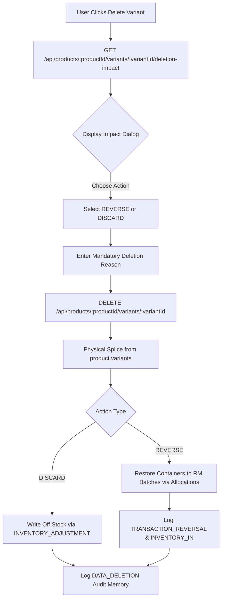
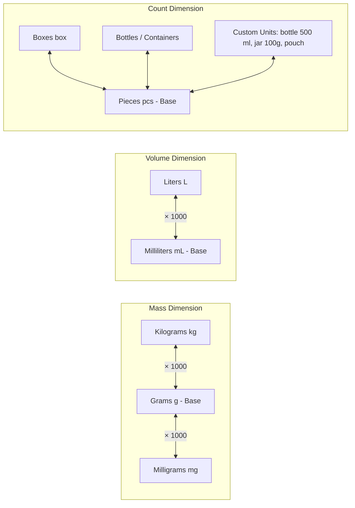

# InvoiceWise 3.1.0 — Master System Workflow, Architecture & Operational Blueprint

**Document Identifier:** `DOC-IW-V3-MASTER`  
**Release Version:** Version 3.1.0 (Enterprise Manufacturing ERP, Batch Packaging & GST Invoicing)  
**Classification:** Master Technical Architecture & System Reference Blueprint  
**Date:** September 2026  
**Author:** InvoiceWise Core Architecture & Engineering Team  

---

## Executive Summary

**InvoiceWise 3.1.0** is an enterprise-grade, standalone Windows desktop Enterprise Resource Planning (ERP) and GST Tax Billing system engineered specifically for batch-formulation manufacturers, chemical processors, cosmetic formulators, pharmaceutical laboratories, and FMCG packaging companies.

Version 3.1.0 introduces a synchronized **Product Variation + Raw Material Packaging, Vendor & FIFO Architecture**, an atomic **Bill of Materials (BOM) multi-vendor formulation engine**, dynamic **multi-dimension unit conversion pipelines**, **controlled variation deletion governance (Stock Reversal vs. Discard)**, **cryptographic SHA-256 audit chaining**, and **100% local-first atomic JSON persistence**—all running within a zero-cloud-overhead, zero-database-install desktop runtime.

---

# 1. Architectural Principles & Isolation Hierarchy

InvoiceWise operates on a strict multi-tier inventory isolation model to ensure mathematical precision and eliminate stock drift:

```
[Raw Materials: Ingredients & Packaging Containers]
   │
   ├─► (1. Formulation Run) ──► [Finished Goods Bulk Pool]
   │                                   │
   └─► (2. Bottling Run) ──────────────┴──► [Packaged Product Variations (SKUs)]
                                                   │
                                                   ▼
                                       (3. GST Sales Invoicing) ──► [Sold to Customer]
```

### 1.1 Single Source of Truth for Packaging Items & Universal Container Units
- **Product Variations never own empty containers**: Bottles, jars, caps, pouches, labels, boxes, cartons, and drums are never manually stocked or duplicated on the Product Variation.
- **Universal Container Units**: Packaging sizes are not fixed to volume (`mL`, `L`) or weight (`g`, `kg`). The system natively supports discrete packaging units: `box`, `carton`, `bottle`, `container`, `packet`, `pouch`, `jar`, `can`, `strip`, `tube`, `vial`, `bag`, `roll`, `drum`, `pcs`, and custom units.
- The Raw Material inventory (`data/raw_materials.json` and `data/raw_material_batches.json`) serves as the **single source of truth** for all container stock, purchase costs, vendor lots, and FIFO balances.
- The variation record stores only:
  - `variantId`: Unique variant identifier.
  - `name`: Variation label (e.g. *Sugar Water Drink - 500 mL*, *Herbal Tea - 1 Box*).
  - `bottleSize` & `bottleSizeUnit`: Physical container capacity (e.g., $500\text{ mL}$, $1\text{ kg}$, $1\text{ box}$, $1\text{ carton}$).
  - `packagingRawMaterialId`: Reference to the container/box Raw Material.
  - `packagingQty`: Units of packaging consumed per finished container (default: `1`).
  - `vendorPreference`: `{ mode: 'FIFO' | 'VENDOR', vendorId: string | null }`.
  - `price`: Commercial retail selling price per finished pack/container.
  - `stock`: Current ready-to-sell finished packaged units produced via packaging runs.

### 1.2 Vendor Selection & Allocation Rules
- **FIFO (Oldest Batch First)**: Container batches are consumed in strict chronological order of inward arrival (`purchaseDate` / `createdAt`).
- **Preferred Vendor**: Prioritizes batches from the chosen vendor (matched by `vendorId`, `vendorName`, or `supplier`). If the preferred vendor's active stock is exhausted, the system automatically falls back to FIFO order for the remaining needed containers.
- **Dynamic Live Discovery**: The UI detects and dynamically populates vendors from active purchase batches and primary suppliers for the chosen packaging item, showing real-time batch stock per vendor.

### 1.3 Synchronized Packaging Runs
When executing a bottling/packaging run (`POST /api/products/:id/fill-bottles`):
1. **Bulk Manufactured Stock**: Deducted from Finished Goods (`finished_goods.json`) in base units ($\text{mL}$ or $\text{g}$).
2. **Packaging Containers**: Deducted from Raw Material inventory (`raw_materials.json`) and specific batches (`raw_material_batches.json`) based on FIFO / vendor preference.
3. **Traceability Logging**: An atomic `VARIANT_PACKAGING` transaction is written to `raw_material_transactions.json` containing exact allocations:
   ```json
   {
     "batchId": "RMB-2026-0001",
     "supplierBatchNumber": "LOT-BOTTLE-A1",
     "vendorName": "Vendor A Bottles Pvt Ltd",
     "quantity": 40,
     "unitCost": 5.00,
     "totalCost": 200.00
   }
   ```
4. **Audit Trail**: An `INVENTORY_OUT` audit record is added to `manufacturing_audit.json` with SHA-256 hash chaining.

### 1.4 Zero Double-Deduction Guarantee
- Generating a commercial GST tax invoice (`POST /api/invoices`) deducts **strictly and solely** from `variant.stock`.
- Raw materials and bulk manufacturing pools are **untouched** during invoicing, preventing double inventory deductions.

---

# 2. Product Variation Deletion Governance & Stock Reversal

To protect transaction history and prevent orphan records, variation deletion enforces strict lifecycle governance:



### 2.1 Pre-Deletion Impact Analysis (`GET .../deletion-impact`)
Before deleting a variation, the system computes:
- `currentStock`: Current packaged units ready to sell.
- `totalProduced`: Historic units bottled across all `VARIANT_PACKAGING` transactions.
- `totalSold`: Historic units invoiced on commercial tax invoices.
- `maxEligibleReversal`: $\min(\text{currentStock}, \text{totalProduced})$ — the upper bound of packaging containers that can be physically returned to raw material inventory.
- `packagingRawMaterial`: Real-time stock and unit metadata of the associated packaging item.
- `activeTransactions`: Count of historical packaging runs for this variation.

### 2.2 Mandatory Deletion Rationale & Actions
- Every deletion requires a non-empty `reason` string. Requests without a reason are rejected with HTTP 400.
- **Action 1: `REVERSE` (Stock Reversal to Raw Material Batches)**:
  - Reverses up to `maxEligibleReversal` containers.
  - Unwinds allocations from newest to oldest packaging transaction, incrementing `remainingQuantity` on the exact original vendor batches (`RMB-YYYY-NNNN`).
  - Restores parent raw material stock (`current_stock`).
  - Logs `TRANSACTION_REVERSAL` in `raw_material_transactions.json`.
  - Logs `TRANSACTION_REVERSAL` and `INVENTORY_IN` in `manufacturing_audit.json` sharing an audit correlation ID (`AUD-YYYY-NNNNNN`).
- **Action 2: `DISCARD` (Write-Off)**:
  - Finished packaged goods are permanently written off.
  - Packaging raw materials remain untouched.
  - Logs `INVENTORY_ADJUSTMENT` in `manufacturing_audit.json`.

### 2.3 Physical JSON Removal & Permanent Audit Snapshot
- The variation is physically removed (`.splice()`) from `product.variants[]` in `products.json`.
- A permanent `DATA_DELETION` audit memory is logged into `manufacturing_audit.json` capturing the full snapshot:
  ```json
  {
    "action": "DATA_DELETION",
    "entityType": "PRODUCT_VARIATION",
    "entityId": "VAR-001",
    "reason": "Discontinuing 500 mL size due to container supply change",
    "actionTaken": "REVERSE",
    "stockReversedToRM": 60,
    "deletedRecord": { ... }
  }
  ```

### 2.4 Strict Dependency Guards & Clear Audit Invariants
- **Raw Material Guard**: Attempting to delete a Raw Material (`DELETE /api/raw-materials/:id`) that is currently referenced as `packagingRawMaterialId` by any active variation is blocked with HTTP 400 and logged as `DEPENDENCY_BLOCK`.
- **Clear Audit Independence**: Invoking "Clear All Audit Ledgers" purges audit records and transaction history, but **never** restores deleted variations to `products.json`.

---

# 3. Multi-Dimension Unit Conversion Matrix

InvoiceWise implements a universal unit conversion engine capable of handling mass, volume, count, and custom container units without rounding drift:



### 3.1 Custom Container Unit Resolution
When a raw material is configured with a custom container descriptor (e.g. `bottle 500 ml`, `bottle 200 ml`, `jar 100g`, `vial 10ml`):
- The unit engine classifies it under the `count` dimension.
- It converts 1:1 with `pcs` and `bottle`.
- In the BOM recipe formulation builder, selecting this item auto-detects `CUSTOM` and pre-fills the descriptor.
- During packaging deduction, unit quantities are deducted with integer precision.

---

# 4. Multi-Batch Lineage & Inward Purchases

### 4.1 Inward Stock Reception (`RMB-YYYY-NNNN`)
Every inward raw material purchase is cataloged with:
- `supplierBatchNumber` / `lotNumber`
- `vendorName` & `vendorGstNumber`
- `originalQuantity` & `remainingQuantity`
- `cost_per_unit` & `vendorPrice`
- `purchaseDate` & `receivedDate`
- `status`: `ACTIVE`, `CONSUMED`, or `DELETED`

### 4.2 Mathematical Invariant
The server enforces a strict invariant across all raw materials:
$$\text{Parent Current Stock} = \sum_{b \in \text{Active Batches}} b.\text{remainingQuantity}$$

### 4.3 End-to-End Traceability
Users can trace any batch from inward supplier lot through formulation, bulk vat, bottling packaging run, and commercial customer invoice:
$$\text{Inward Lot (RMB)} \longrightarrow \text{Production Run (MFG)} \longrightarrow \text{Bulk Yield (FGB)} \longrightarrow \text{Bottling Run} \longrightarrow \text{Tax Invoice (INV)}$$

---

# 5. Cryptographic SHA-256 Audit Trail

All system state mutations are cryptographically recorded in `data/manufacturing_audit.json`:


- Each record contains:
  - `auditCorrelationId`: `AUD-YYYY-NNNNNN`
  - `action`: `INVENTORY_IN`, `INVENTORY_OUT`, `MANUFACTURING_DEDUCTION`, `TRANSACTION_REVERSAL`, `DATA_DELETION`, `DEPENDENCY_BLOCK`
  - `precedingHash`: SHA-256 hash of previous block
  - `hash`: SHA-256 hash of current block
  - `timestamp`: ISO-8601 UTC timestamp
  - `immutable`: `true`

---

# 6. Data Storage & JSON Schema Inventory

InvoiceWise operates with 14 atomic, human-readable JSON stores in `data/`:

| File | Purpose | Primary Keys |
| :--- | :--- | :--- |
| `settings.json` | Company profile, GSTIN, PAN, Bank Details | Single object |
| `raw_materials.json` | Master raw material definitions & stock | `id` (`RM-NNNNNN`) |
| `raw_material_batches.json` | Inward supplier lots & remaining balances | `id` (`RMB-YYYY-NNNN`) |
| `raw_material_transactions.json` | Inward, consumption & packaging transaction ledger | `id` (`RMT-NNNNNN`) |
| `products.json` | Product catalog with nested `variants[]` | `id` (`PRD-NNN`), `variantId` |
| `customers.json` | Customer profiles, GSTIN, billing addresses | `id` (`CUST-NNN`) |
| `recipes.json` | BOM multi-stage formulations & vendor rules | `id` (`REC-NNN`) |
| `recipe_history.json` | Version history of recipe edits | `id` |
| `manufacturing_batches.json` | Committed production batch runs | `id` (`MFG-YYYYMMDD-NNNNN`) |
| `manufacturing_audit.json` | Immutable SHA-256 chained audit trail | `id`, `auditCorrelationId` |
| `finished_goods.json` | Bulk manufactured inventory pools | `id` (`FG-NNN`) |
| `finished_goods_transactions.json` | Finished goods inward/outward ledger | `id` (`FGT-NNNNNN`) |
| `invoices.json` | Rule 46 GST tax invoices & line items | `id` (`INV-YYYY-NNNN`) |
| `notes.json` | Scratchpad notes & sticky reminders | `id` |

---

# 7. Release Packaging & Verification Matrix

### 7.1 Production Windows Executables
Compiled using `electron-builder` with zero external runtime dependencies:
- **Portable Binary:** `InvoiceWise 3.1.0.exe` (Standalone portable executable, runs instantly without installation).
- **NSIS Installer:** `InvoiceWise Setup 3.1.0.exe` (Standard Windows installer with desktop and Start Menu shortcuts).

### 7.2 Automated Verification Matrix
All 48 architectural and regression requirements are verified via automated suite:
- `node scratch/test_final_variation_architecture.js` (48/48 core architectural checks passed)
- `node scratch/test_box_carton_variant.js` (Universal box/carton packaging verification passed)
- `node scratch/test_no_variant_invoice_block.js` (Variant enforcement and invoice guard verification passed)

```
✓ Step 1: Create Packaging Raw Material (201)
✓ Step 2: Add Inward Batches (Vendor A & Vendor B) with exact sum validation
✓ Step 3: Setup Product & Variation referencing Raw Material packaging
✓ Step 4: Verify Raw Material Deletion Dependency Guard (HTTP 400 + DEPENDENCY_BLOCK)
✓ Step 5: Execute Synchronized Bottling Deduction (Dual deduction & FIFO batch tracking)
✓ Step 6: Test Commercial Sales Invoicing (Zero double deduction on Raw Materials)
✓ Step 7: Query Deletion Impact API (Finished stock, max reversal, active transactions)
✓ Step 8: Validate Mandatory Deletion Rationale (HTTP 400 rejection on empty reason)
✓ Step 9: Execute Variation Deletion with REVERSE Action (Exact batch restoration)
✓ Step 10: Verify Comprehensive Audit Trail Lineage (Correlated AUD IDs)
✓ Step 11: Verify Clear Audit Guarantees (Deleted variants never return to products.json)
✓ Step 12: Verify Variation Deletion with DISCARD Action (Controlled write-off)
✓ Step 13: Universal container packaging (Box, Carton, Jars, Pouches, Tubes without unit mismatch)
✓ Step 14: Strict variant check on commercial invoicing (HTTP 400 + UI alert blocking unconfigured items)
```

---

# 8. Universal Packaging Containers & Commercial Invoicing Rules

### 8.1 Universal Container & Packaging Units
InvoiceWise does not restrict container types or units to liquids (`mL`, `L`) or weights (`g`, `kg`). It features full support for discrete packaging types:
- **Available Container Units:** `box`, `carton`, `bottle`, `container`, `packet`, `pouch`, `jar`, `can`, `strip`, `tube`, `vial`, `bag`, `roll`, `drum`, `pcs`, `unit`, `mL`, `L`, `g`, `kg`, `mg`.
- **Packaging Deduction Normalization:** Bulk finished goods in any unit (e.g. `g`, `kg`, `mL`, `L`) can be packaged into discrete boxes or cartons without dimension errors. Each packaging run consumes bulk goods based on capacity and deducts 1 packaging unit (or custom `packagingQty`) from the packaging material inventory per finished container.

### 8.2 Strict Commercial Invoice Variant Enforcement
In InvoiceWise, commercial sales invoices deduct **strictly and solely** from ready-to-sell packaged variant stock (`variant.stock`).
- **Zero Orphan Sales Policy:** Products without container or packaging variants cannot be invoiced.
- **Frontend Guards:**
  - In the line items dropdown, products without variants display a warning badge: `⚠️ (No Variants - Add Variant in Catalog First)`.
  - Selecting an unconfigured product triggers an interactive alert modal instructing the user to configure a packaging/bottle variant in the Product Catalog first, and resets the line item selection.
  - If an unconfigured product is present on an invoice, real-time validation flags a red warning banner and disables the "Save & Print" and "Save as Draft" buttons.
  - Attempting to submit calls `saveInvoice()`, which blocks submission and shows an error alert.
- **Backend API Validation:** `POST /api/invoices` checks every item against `products.json`. If `!prd.variants || prd.variants.length === 0`, the endpoint returns HTTP 400 with a detailed error message, ensuring complete integrity across API and UI clients.

---

# 9. Deep QA, Failure Injection & Production Data Sanitization

### 9.1 Master Deep QA Suite (`npm run qa:deep`)
InvoiceWise 3.1.0 includes an automated test runner executing 24 production-hardening tests across 14 categories:
1. **P0 Critical Transactional Integrity**:
   - **P0-001: Packaging Transaction Atomicity**: Inward lots and finished goods pools remain unchanged on failed packaging requests.
   - **P0-002: Invoice Double-Click Race Test**: Concurrent requests to bill the exact same item do not double-deduct packaged stock.
   - **P0-003: Two-Process Concurrent Invoice Test**: Two simultaneous processes attempting to consume available stock are serialized via in-memory and `.inventory.lock` mutexes.
   - **P0-004: Insufficient Stock Race**: Oversubscribed inventory requests fail safely with HTTP 400.
   - **P0-005: Variant Deletion After Partial Sales**: Only remaining unsold stock (e.g. 60 units) is reversed to raw material lots; sold units (40 units) are never restored.
   - **P0-006: Variant Deletion Across Multiple Production Runs**: Cumulative stock is correctly evaluated before executing reversal.
   - **P0-007: Repeated Deletion / Recovery Protection**: Repeated deletion requests reject safely without duplicate reversals.
   - **P0-008: Cryptographic SHA-256 Audit Tampering Detection**: Altered audit entries trigger chain verification failure on startup or via `GET /api/manufacturing-audit/verify`.
   - **P0-009: Audit Chain Order Validation**: Inward, production, and invoice events maintain sequential blockchain-style SHA-256 hashes.
   - **P0-010: Audit Deletion Protection**: Audit ledgers enforce append-only semantics.
   - **P0-011: Raw Material Dependency Graph Test**: Raw Materials linked to Recipes or Product Variants are blocked from deletion with HTTP 400.
   - **P0-012: JSON Corruption Recovery**: Atomic write strategies (`.tmp` -> `renameSync`) prevent partial file writes during sudden shutdowns.
   - **P0-013 to P0-015: Boundary & Numeric Injection**: Strict rejection of negative quantities, zero quantities, `NaN`, and `Infinity`.

2. **P1 Packaging, Unit Conversions & Allocation**:
   - Mass conversion (`kg`, `g`, `mg`), volume conversion (`L`, `mL`), discrete container counts (`box`, `carton`, `pcs`, `jar`, `pouch`, `tube`), integer packaging validation, FIFO & vendor allocation, commercial invoice variant enforcement, and backup export.

3. **P2 15-Point Data Integrity Scanner (`npm run verify:integrity`)**:
   - Real-time scanner checking JSON syntax, primary key uniqueness, foreign key validity, mathematical invariants ($\text{Parent Stock} = \sum \text{Batches}$), finished goods stock, invoice integrity, SHA-256 audit chaining, and orphan transactions.

### 9.2 Production Data Sanitization (Fresh Deployment Baseline)
To ensure that newly deployed instances or packaged executables start completely fresh with zero sample or test data:
```bash
# Execute production data sanitizer
npm run clean
```
- **Scope**: Sanitizes all 14 data stores in both the local project `data/` folder and the Windows AppData directory (`%APPDATA%\InvoiceWise\InvoiceWiseData`).
- **Pristine State**: Initializes empty arrays (`[]`) and zero sequences for `products.json`, `raw_materials.json`, `raw_material_batches.json`, `recipes.json`, `recipe_history.json`, `manufacturing_batches.json`, `manufacturing_audit.json`, `finished_goods.json`, `raw_material_transactions.json`, `finished_goods_transactions.json`, `invoices.json`, `customers.json`, and `notes.json`.
- **Default Settings**: Configures fresh default settings in `settings.json` with `firstLaunchCompleted: false`.
- **Binary Inclusion**: The Windows Portable Executable and NSIS Setup Wizard are compiled with this sanitized state, ensuring immediate out-of-the-box readiness for new production deployments.


